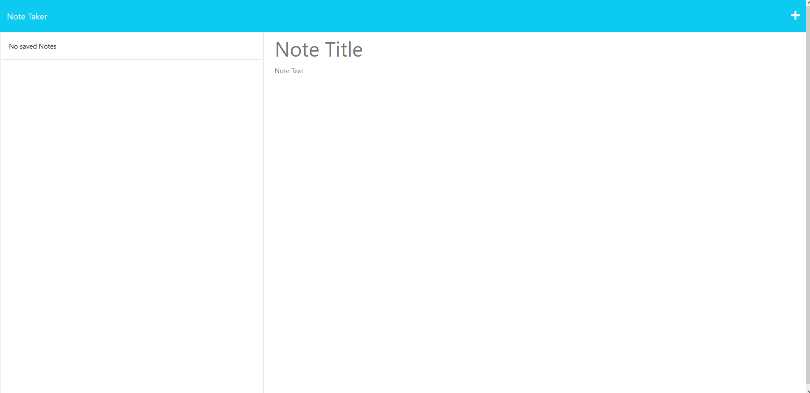
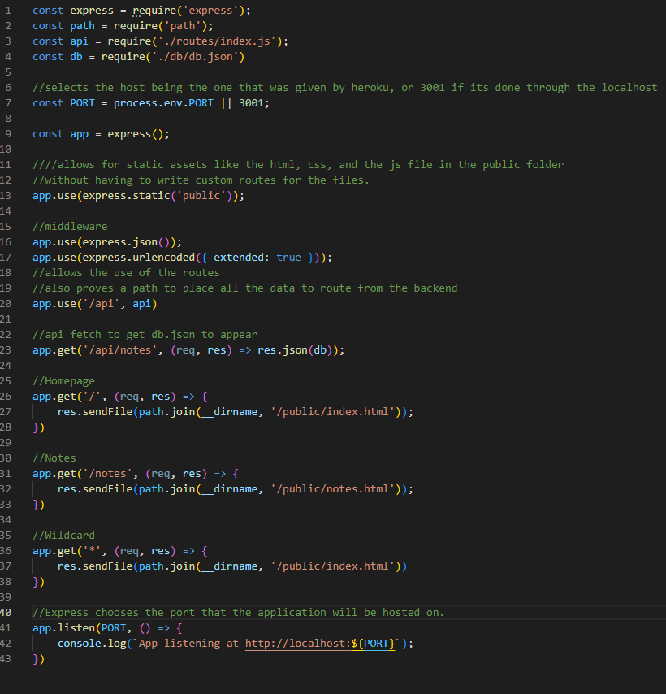
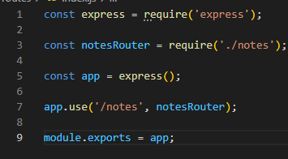
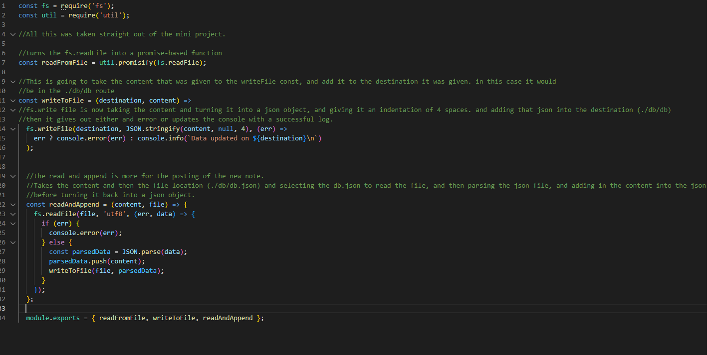
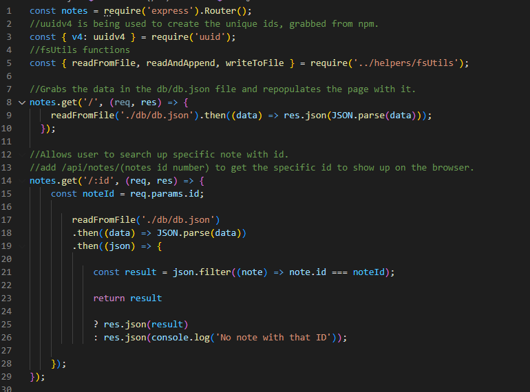
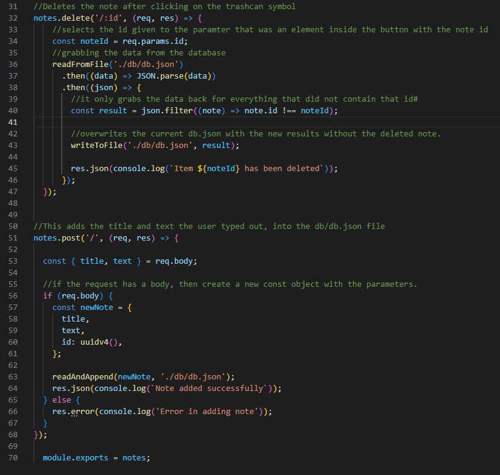

# Challenge-9-Express-Note-Taker
Module 11 challenge #9 of the uci coding bootcamp

## Task

Work on the back-end of a note taker application that has had all the front-end done already.
adding the server side functionality of using express, and using the methods for GET, POST, and DELETE.
Creating a database that hosts all the data that the user has added by adding their own personalized notes, and each note is given n id using uuidv4
fs being used to write down the database that was added by the user.

## Deployed Application

https://challenge9-express-note-taker.herokuapp.com/



## Code Breakdown

First thing that was worked on was just getting the server working to get the index.html working through running the "node server.js" command. That way the index.html file gets hosted on the localhost: port 3001, before it gets deployed and heroku gives the application it's own port.

I began by calling in express, path, api, and db as variables.
For PORT, the process.env.PORT is what would be the port given by Heroku depending on how they do their hosting. and the || 3001 is more for my testing purposes pre-deployment to run the app from localhost.

The picture below has more indepth info on each line of code.



This index.js file was created in case any multiple .js files need to be routed into a central file. At the same time it's helping keep a cleaner code.
This just counts more as a bridge from the notes.js file to the server.js file.



So in order to mess with the json data in db.json, utils was invoked in the helpers folder, extra info on how that code is working in picture. The code did come from the mini project for the most part, with some minor tweaks to make it work with this application,



The main Bulk of the project came from the notes.js file

with the const notes = require('express').router(); It's going to be used to not only call for express, but also route the note.js to the server.js via the index.js.

The other new thing being invoked, is uuid, which came from npm, where we are able to generate the id for each note.

the initial notes.get is more for being able to look up the notes id on the browser by just typing out /api/notes/:id in the search bar, where we will be given a json file that has that notes with the corresponding id.



The notes.delete coincides with the trashcan button in order to delete the note that has the id associated to the html element with the class data-note.

Then the post is going to coincide with the save button on the top right.



## User Story

```
AS A small business owner
I WANT to be able to write and save notes
SO THAT I can organize my thoughts and keep track of tasks I need to complete
```


## Acceptance Criteria

```
GIVEN a note-taking application
WHEN I open the Note Taker
THEN I am presented with a landing page with a link to a notes page
WHEN I click on the link to the notes page
THEN I am presented with a page with existing notes listed in the left-hand column, plus empty fields to enter a new note title and the note’s text in the right-hand column
WHEN I enter a new note title and the note’s text
THEN a Save icon appears in the navigation at the top of the page
WHEN I click on the Save icon
THEN the new note I have entered is saved and appears in the left-hand column with the other existing notes
WHEN I click on an existing note in the list in the left-hand column
THEN that note appears in the right-hand column
WHEN I click on the Write icon in the navigation at the top of the page
THEN I am presented with empty fields to enter a new note title and the note’s text in the right-hand column
```

